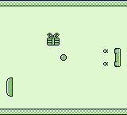

# Frapball

GB homebrew revisiting Pong.


[](https://github.com/1r3n33/frapball/releases/latest)




## Installation on Linux

### Wine

Most of the toolchain is Windows-based.

Install [Wine](https://www.winehq.org/) to properly run the tools:

```bash
$ sudo apt-get install wine
```

### sdcc

1. Install the [sdcc](http://sdcc.sourceforge.net/snap.php#Linux) compiler.

2. Add the `sdcc` executable to the `PATH` environment variable:
   ```bash
   $ export PATH=$PATH:<full_path_to>/sdcc/bin
   ```

### gbdk-n

1. Install the [gbdk-n](https://github.com/andreasjhkarlsson/gbdk-n) SDK:
   ```bash
   $ git clone https://github.com/andreasjhkarlsson/gbdk-n.git
   ```

2. Build the SDK:
   ```bash
   $ cd gbdk-n
   $ make
   ```

3. Set up the `GBDKDIR` environment variable:
   ```bash
   $ export GBDKDIR=<full_path_to>/gbdk-n
   ```

### gbtd22

Install [gbtd22](http://www.devrs.com/gb/hmgd/gbtd.html) image editor to edit `.gbr` files in the `gfx` folder and export bitmaps.

### bgb

Install [bgb](http://bgb.bircd.org/) emulator to play and debug the game.
